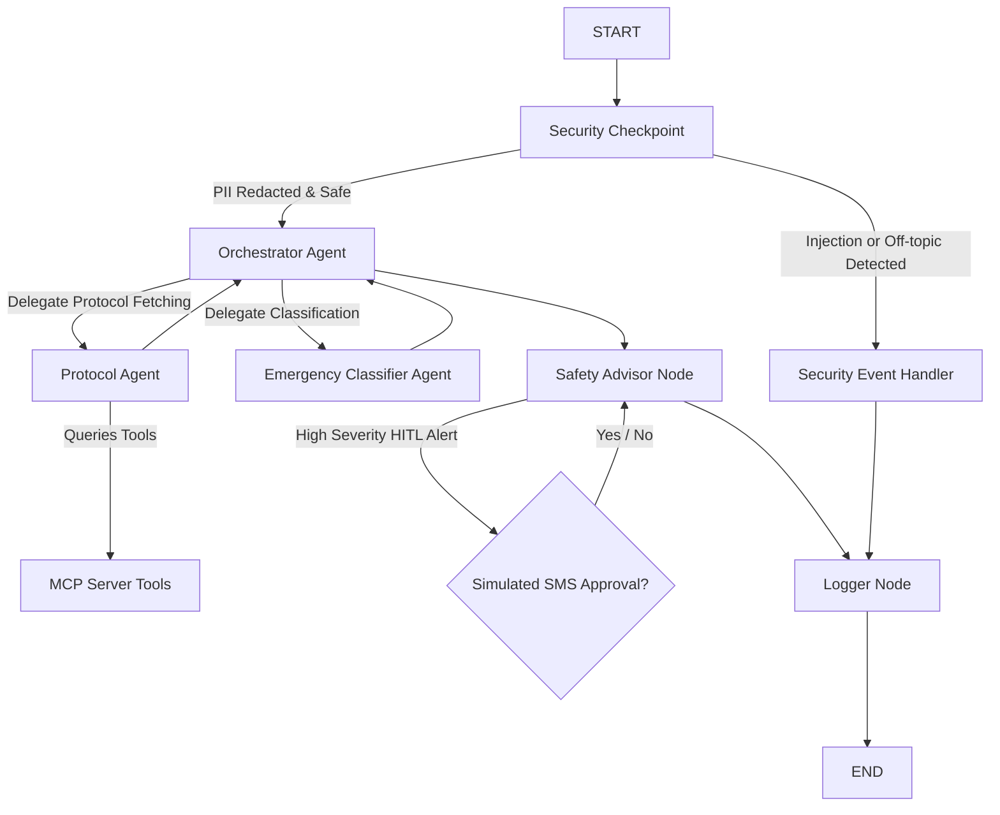

# Submission Write-Up: Family Emergency Drill Agent

## Problem Statement
During home emergencies (such as fires, gas leaks, or medical events), panic and lack of clear protocols often lead to dangerous delays or mistakes. While standard emergency instructions exist, they are rarely personalized to a family's specific contacts, nearest hospital, or local emergency services. The **Family Emergency Drill Agent** provides an interactive, secure concierge system to help families practice emergency drills, receive personalized response steps, and simulate emergency notification workflows in a safe environment.

## Solution Architecture
Below is the workflow architecture of the multi-agent system:

## Concepts Used
1. **ADK 2.0 Workflow**: Implemented as a custom graph using function nodes and edges in [agent.py](file:///d:/ADK%20workspace/family-emergency-drill/app/agent.py#L282-L292).
2. **LlmAgent**: Three specialized agents: `orchestrator_agent`, `emergency_classifier`, and `protocol_agent` in [agent.py](file:///d:/ADK%20workspace/family-emergency-drill/app/agent.py#L136-L175).
3. **AgentTool**: Used by `orchestrator_agent` to delegate classification and protocol retrieval to its specialized sub-agents.
4. **MCP Server**: FastMCP server in [mcp_server.py](file:///d:/ADK%20workspace/family-emergency-drill/app/mcp_server.py) providing 4 custom tools for protocol database access, Pakistani emergency numbers, family contacts, and drill event logging.
5. **Security Checkpoint**: Implemented in [agent.py](file:///d:/ADK%20workspace/family-emergency-drill/app/agent.py#L178-L216) to scrub phone numbers/emails, block injections, and enforce emergency-only topics.
6. **Agents CLI**: Project scaffolded and run using `agents-cli` (wrapped via `uv run adk`).

## Security Design
- **PII Scrubbing**: Regex filters automatically scrub Pakistani format phone numbers (`03xx-xxxxxxx` or `+92xxxxxxxxxx`) and emails from user prompts.
- **Prompt Injection Prevention**: Rejects developer instruction overrides and injection keywords, routing them immediately to a security handler.
- **Off-Topic Query Filtering**: Blocks queries that do not mention emergency keywords, preventing misuse of the LLM.
- **JSON Audit Logging**: Log files (`audit_log.json`) track all events with severity levels (`INFO`, `WARNING`, `CRITICAL`) and event details.

## MCP Server Design
The FastMCP server exposes four domain-specific tools:
- `get_emergency_protocol(category, severity)`: Pulls safety steps and critical warnings from a structured protocol catalog.
- `get_family_profile(profile_id)`: Loads primary/secondary family contacts, home address, and nearest hospital.
- `get_local_emergency_numbers(city)`: Resolves local fire, rescue, police, and hospital contacts for Pakistan (Karachi, Lahore, Islamabad).
- `log_emergency_event(...)`: Appends drill event outcomes to a local history log excluding PII.

## Human-in-the-Loop (HITL) Flow
For critical or high severity emergencies, the workflow pauses at the `safety_advisor` node using `RequestInput` to ask:
> `Would you like me to send a simulated emergency SMS/alert to your primary family contact? (yes/no)`

The execution suspends until the user confirms, simulating real-world safety escalation while keeping the human in control.

## Demo Walkthrough
1. **Input**: `"My phone is 0300-9876543. There's a gas leak in my kitchen."`
2. **Security Checkpoint**: Redacts phone number to `[REDACTED_PHONE]`.
3. **Classification**: Categorized as `GAS_LEAK`, severity `CRITICAL`.
4. **HITL Prompt**: Suspends to ask for simulated SMS confirmation.
5. **Result**: Personalized instructions including evacuation steps, nearest hospital contact, and local emergency number `1122`.

## Impact / Value Statement
The Family Emergency Drill Agent bridges the gap between static response instructions and dynamic, contextual action. It allows families to practice critical safety maneuvers in seconds, ensuring that when every second counts, panic is replaced by prepared execution.
